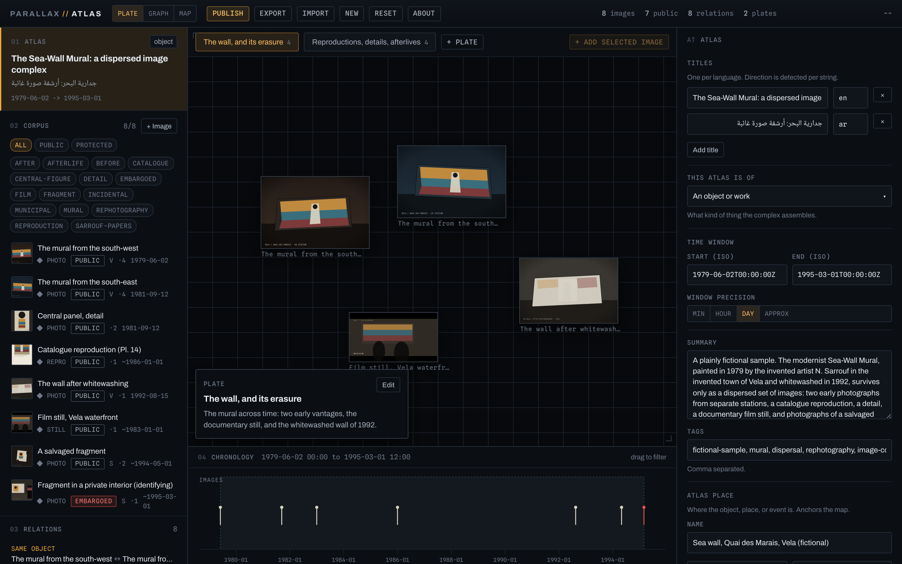
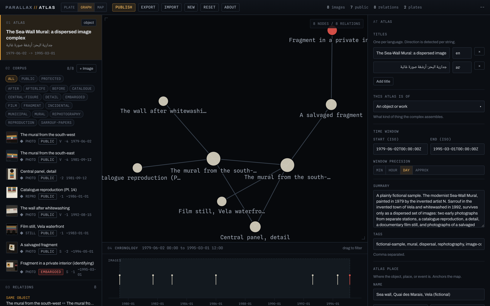
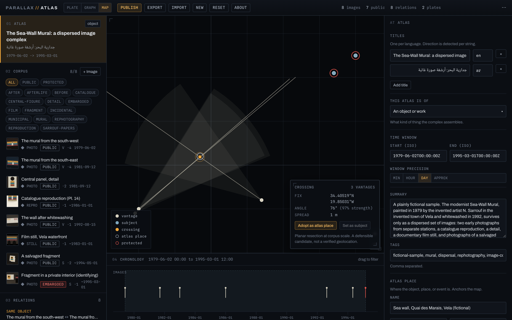
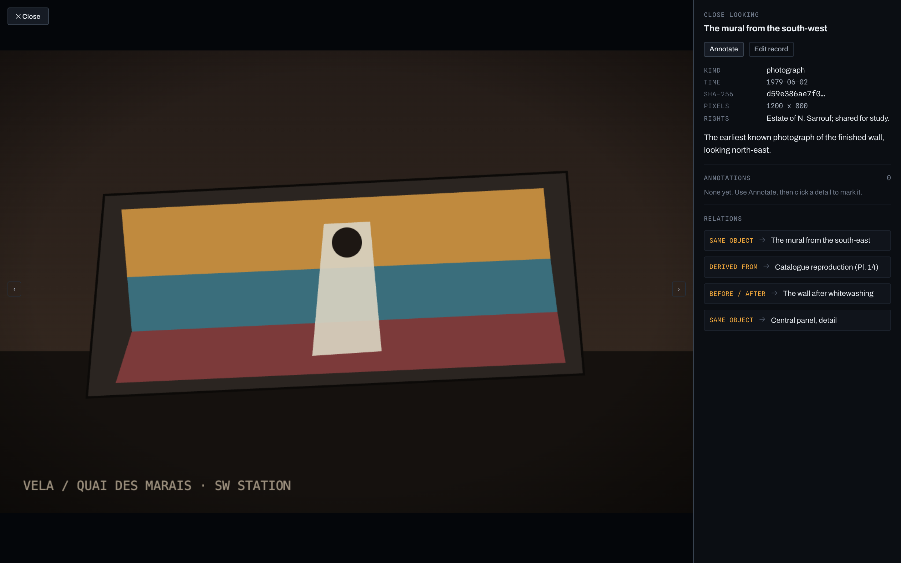
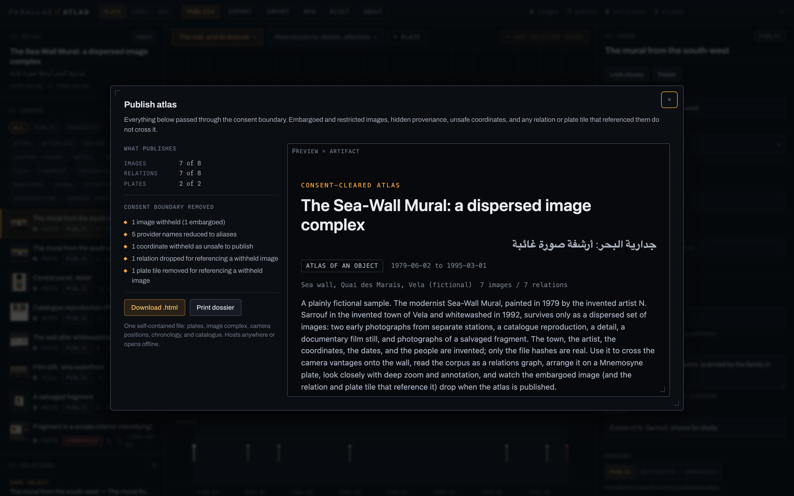
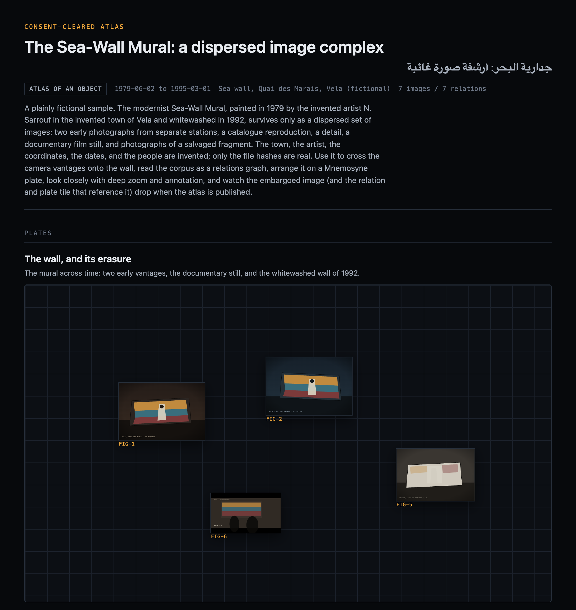

# Atlas

**Assemble many images of one thing into a navigable atlas, across space, relation, and time.**

Atlas is a client-side, local-first workbench for the *image complex*: the many
photographs, reproductions, details, and reshoots that accrete around a single
object, place, or event. You gather the images, relate them, lay them out as a
montage plate, place them on a map, and look closely at any one of them with deep
zoom and annotation. The output is a consent-cleared, self-contained static
artifact.

It is the second instrument in the **Parallax** suite, and it reuses Sightlines'
shared core. Everything runs in your browser. No file is uploaded, no map or
image service is called at runtime, and the default basemap fetches no
third-party tiles, so nothing about your subject leaves your machine.



---

## Contents

- [What it is](#what-it-is)
- [How it works](#how-it-works)
- [Install and run](#install-and-run)
- [The interface](#the-interface)
- [The atlas](#the-atlas)
- [The corpus (images)](#the-corpus-images)
  - [What an image records](#what-an-image-records)
  - [Filtering the corpus](#filtering-the-corpus)
  - [Consent](#consent)
- [The three views](#the-three-views)
  - [Plate: the Mnemosyne board](#plate-the-mnemosyne-board)
  - [Graph: the relations](#graph-the-relations)
  - [Map: positions and resection](#map-positions-and-resection)
- [Relations](#relations)
- [Close looking: the lightbox](#close-looking-the-lightbox)
- [Consent and release](#consent-and-release)
- [Publishing](#publishing)
- [Saving and sharing projects](#saving-and-sharing-projects)
- [Starting over: New and Reset](#starting-over-new-and-reset)
- [A worked example](#a-worked-example-end-to-end)
- [Keyboard and accessibility](#keyboard-and-accessibility)
- [Limits and caveats](#limits-and-caveats)
- [Privacy and data handling](#privacy-and-data-handling)
- [Troubleshooting](#troubleshooting)

---

## What it is

The question Atlas answers is: **these images all circle one thing; how do they
relate, where were they made, and what does the whole say that no single image
does?** It is Aby Warburg's Mnemosyne plate meeting Forensic Architecture's
operative model: a working surface where images are placed beside one another,
linked by explicit relations, and read across reproduction and time.

Atlas gives one body of images three readings at once: a **spatial** montage (the
plate), a **relational** graph, and a **geographic** map. The same corpus, the
same selection, seen three ways.

What it is **not**:

- Not a digital asset manager or catalogue. It is an argument-making surface, not
  a store.
- Not a cloud tool. It calls no service at runtime; you bring the images, and
  nothing about the subject leaks.
- Not a verified geolocation service. Where it resects positions, a crossing is a
  candidate, not a survey (as in Sightlines).

---

## How it works

An Atlas is built from a few kinds of record:

- **The atlas** is the complex itself: its titles, what kind of thing it gathers
  (an object, a place, an event), a time window, a summary, tags, and an optional
  place that anchors the map.
- **Images** are the corpus. Each carries its kind, a date, its provider and
  provenance, rights, a consent level, an optional held file (with a SHA-256 hash,
  pixel dimensions, and an optional IIIF endpoint), any geography it supports, a
  note, and point annotations.
- **Relations** are explicit, typed links between two images (same object, a
  detail of, derived from, before and after, and so on), with a direction and a
  certainty.
- **Panels** are Mnemosyne plates: montage boards onto which you arrange images at
  chosen positions and scales.

Everything you publish or export passes through one **consent boundary** that
decides what may cross. It drops non-public images and, crucially, drops any
relation or plate tile that would betray a withheld image.

Your typed records live in your browser's IndexedDB; image bytes are held there as
blobs and recomputed into thumbnails and deep-zoom tiles on demand, never sent
anywhere.

---

## Install and run

Atlas is a static client-side app built with Vite.

```bash
cd tools/atlas
npm install        # first time only
npm run dev        # opens a local dev server (Vite prints the URL)
```

For a production bundle:

```bash
npm run build      # outputs to dist/
npm run preview    # serves the built bundle locally
```

On first launch the app loads a **fictional sample atlas** (an invented dispersed
mural) so there is something to drive immediately. Your work saves to the browser
automatically.

---

## The interface

The window has three columns. A left **rail** carries the atlas card, the corpus
with its filters, and the relations list; a central **stage** that switches
between three views; and a right **inspector** that edits whatever is selected.
The topbar holds the view switcher, the actions, and a live **readout** (images,
how many public, relations, plates, and the cursor's coordinates).

- Click the **atlas card** to edit the atlas.
- Click any **image** or **relation** row to select it.
- The view switcher (**Plate / Graph / Map**) changes the stage; the rail and
  inspector stay put, so your selection follows you between views.

Rail rows are keyboard-navigable: tab to a row and press Enter or Space.

---

## The atlas

Selecting the atlas card opens its editor:

- **Titles.** One per language, direction detected per string. The first names the
  atlas and the saved file.
- **This atlas is of.** Whether the complex gathers an object, a place, or an
  event.
- **Time window** with a precision (minute, hour, day, approximate).
- **Summary** and **tags.**
- **Atlas place.** A name, coordinates, a **safe to publish** toggle, and a **Move
  on map** button. This is the anchor the map view orients to.

---

## The corpus (images)

Press **+ Image** on the rail's Corpus section to add one.

### What an image records

- **Title** and **kind** (photograph, reproduction, detail, still, and so on).
- **Time** with precision.
- **Provenance and rights**: a **provider** (aliased in anything published), a
  **provenance** (held for your record, never published), and **rights** (may
  publish).
- **File**: an attached image is hashed (SHA-256) and its pixel dimensions
  recorded; you may instead point to a **IIIF** image endpoint for deep zoom
  without holding the bytes.
- **Subject** and **vantage**: the geography the image supports, for the map view.
- **Note** and **annotations** (point marks placed in the lightbox, see below).

### Filtering the corpus

The rail carries facet chips: filter the corpus to **All**, **Public**, or
**Protected**, and by any **tag**. The filters narrow what shows in the rail and
across the views, so you can work a subset of a large complex.

### Consent

Each image carries one consent level, public or embargoed (with restricted held
for your work only). Embargoed images are kept in your project for the record but
never cross the consent boundary, and neither do the relations or plate tiles that
reference them.

---

## The three views

### Plate: the Mnemosyne board

The Plate is the signature surface: a montage board onto which you arrange images
spatially, as Warburg arranged photographs on black cloth.

- Create a board with **+ Plate**, and give it a title and caption from the
  caption card.
- Select an image in the rail and press **Add selected image** to place it on the
  active plate.
- **Drag** a tile to move it and use its handle to **scale** it. Positions and
  scales are stored normalized to the board, so the layout is the argument and it
  travels into exports.
- A plate can hold many images; a complex can hold many plates (the readout counts
  them).

### Graph: the relations

The Graph lays the corpus out as a force-directed network: each image is a node,
each relation an edge labelled with its kind. It is the relational reading of the
same images.



- The header reports the node and relation counts.
- **Click two nodes** to draw a relation between them.
- Click a single node to open that image in the lightbox.

### Map: positions and resection

The Map places images that carry a subject or a vantage, and where several
vantages of one object cross, it resects a candidate position, reusing Sightlines'
geometry. The crossing card offers **Adopt as atlas place**. As in Sightlines, a
crossing is a defensible candidate, not a verified geolocation, and the basemap is
a synthetic graticule that fetches no tiles.



---

## Relations

A relation is an explicit, typed link between two images. Select a relation in the
rail (or draw one in the Graph) to edit it:

- **Kind**: same object, detail of, derived from, before and after, and the other
  relation types, each shown with a short label.
- **Direction**: whether the relation is directed (a derived-from points one way)
  or symmetric (same-object goes both ways).
- **Certainty**: how sure the link is.

Relations are what turn a pile of images into a complex; they also constrain the
consent boundary, which drops any edge whose endpoints did not both survive.

---

## Close looking: the lightbox

Press **Look closely** on a selected image (or click its node in the Graph) to
open the deep-zoom lightbox. This is the close-reading surface.



- **Deep zoom and pan** over the full-resolution image, served from the held bytes
  as a single-image pyramid, or from a IIIF endpoint when one is set. Nothing is
  fetched from a tile server for held images.
- **Metadata**: the image's kind, time, SHA-256 hash, pixel dimensions, and
  rights.
- **Annotate**: press Annotate, then click a detail to drop a labelled mark. An
  inline label field opens at the click (it commits on Enter or the Add button,
  and Escape cancels without closing the viewer). Marks are stored normalized to
  the image, so they stay glued under any zoom and travel into exports. Remove a
  mark from the list in the side panel.
- **Relations**: the linked images are listed; click one to jump straight to it in
  the lightbox, following the complex by close looking.
- Move between images with the arrows, and close with Escape.

---

## Consent and release

Two controls govern what may publish: an image's **consent level** (public,
restricted, embargoed) and a point's **safe to publish** flag (the atlas place, a
subject, a vantage).

When you publish or export, one boundary function (`publicClone`) runs over the
whole atlas and:

- keeps only public images, dropping restricted and embargoed ones;
- reduces every provider name to a stable alias;
- withholds a coordinate marked not safe to publish (or coarsens it);
- **drops any relation** whose two endpoints did not both survive, so an edge
  cannot reveal a hidden node;
- **removes any plate tile** that references a withheld image, so the montage
  cannot betray it;
- omits provenance, held file names, and internal keys.

The cascade through relations and plate tiles is the safeguard particular to
Atlas: a withheld image takes its links and its montage place with it.

---

## Publishing

**Publish** in the topbar runs the atlas through the consent boundary and opens a
dialog showing what publishes (images, relations, and plates surviving out of the
totals), a plain-language list of everything the boundary removed (including
relations dropped and plate tiles removed for referencing a withheld image), and a
live preview that is the artifact.



**Download .html** gives you a single self-contained file: the plates with their
images, the relation graph, the map, the corpus with hashes, and the consent
disclosure. It opens offline and hosts anywhere.



---

## Saving and sharing projects

- **Export** saves the whole atlas as a single `.atlas.json` file, media included,
  so it round-trips exactly.
- **Import** loads a project file back.

---

## Starting over: New and Reset

- **New** starts an empty atlas (no images, relations, or plates). It confirms in
  two steps in the toolbar; export first if you want to keep the current one.
- **Reset** replaces the current atlas with the fictional sample, the same
  two-step confirm.

---

## A worked example, end to end

1. Add the **images** of one object, attaching files so each is hashed; point to
   IIIF endpoints where you have them.
2. Record each image's **provider**, **provenance**, and **consent** level; mark
   the identifying or embargoed ones accordingly.
3. In the **Graph**, click pairs of nodes to draw the **relations** between them
   (same object, detail of, derived from, before and after).
4. Build a **Plate**: add the images and arrange them into the montage that makes
   your argument.
5. Place the geolocatable images on the **Map** and adopt a crossing as the atlas
   place if the geometry is sound.
6. **Look closely** at the key images and annotate the telling details.
7. **Publish**, confirm what the consent boundary withheld (including any dropped
   relations and plate tiles), and download the artifact.

---

## Keyboard and accessibility

The rail's image and relation rows are reachable by keyboard (tab, then Enter or
Space, with a visible focus ring). In the lightbox, the annotation label field
takes focus on open, commits on Enter, and cancels on Escape without closing the
viewer. Text direction is detected per string for titles, notes, and annotations.

---

## Limits and caveats

- **A candidate, not a survey.** A map resection crossing is a defensible
  candidate, not a verified geolocation.
- **You bring the images.** The tool fetches nothing at runtime; IIIF endpoints,
  if you use them, are the one exception and are loaded only for deep zoom.
- **The basemap is synthetic.** The map background is a graticule with no tiles; it
  gives geometry and scale, not satellite context.

---

## Privacy and data handling

Atlas is local-first. Typed records and image bytes live in your browser's
IndexedDB and are never uploaded. The synthetic graticule basemap makes no tile
requests. The published artifact is a single file you control; nothing is sent
anywhere unless you choose to share that file. If you reference a IIIF endpoint,
the lightbox loads tiles from that server when you open the image, which is the
one outward request the tool makes, and only at your instruction.

---

## Troubleshooting

- **An image will not deep-zoom.** It has no held file and no IIIF endpoint.
  Attach the file or set an endpoint.
- **A relation will not publish.** One of its two images is not public; the
  boundary drops edges whose endpoints did not both survive.
- **A plate tile vanished in the artifact.** It referenced a withheld image and was
  removed by the boundary, by design.
- **The Graph is sparse.** Relations are explicit; draw them by clicking pairs of
  nodes, or with the Relate action on a selected image.
- **The map is blank.** No image carries a publishable coordinate yet; place a
  subject or a vantage.

---

*Atlas is part of the Parallax suite. Founded and directed by Jeff O'Brien.*
